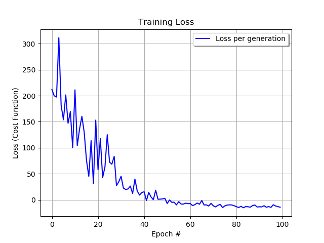
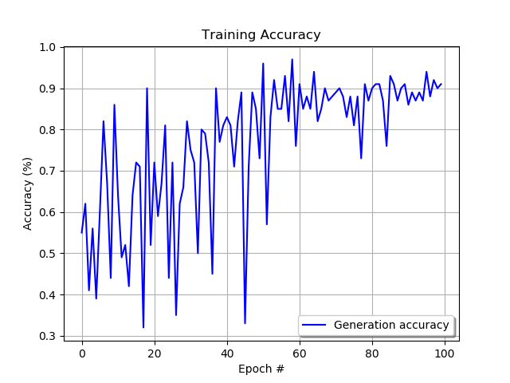
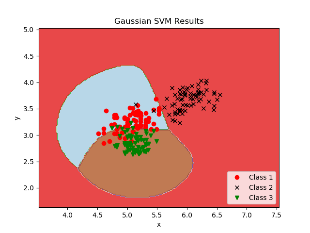
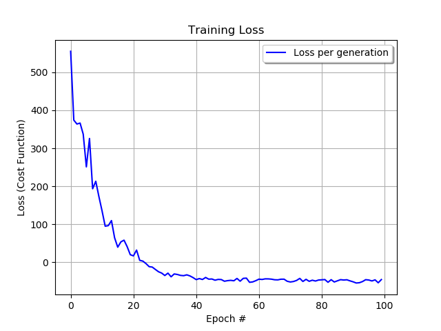
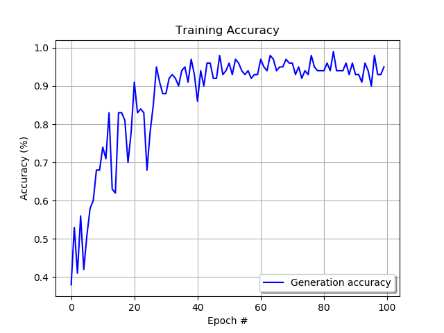
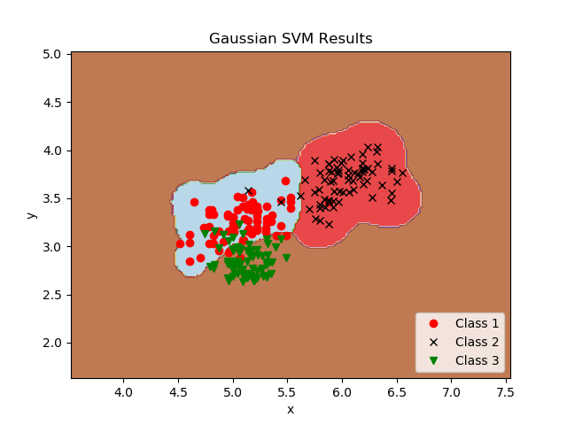

# Support Vector Machines implementation using TensorFlow

## Overview
This is a basic implementation of SVM using Google's TensorFlow. This is the second repo of a projected aimed at introduce myself to TF's data flow graphs and general best practices around python and machine learning.

## Requirements
```bash
Numpy >= 1.14.0
TensorFlow >= 1.4.0
```

## Model description
This implementation leverages the GradientDescentOptimizer method and implements both LINEAR and GAUSSIAN transformation kernels. The model has no feature or class restrictions.

## Data
The model was tested using the Seeds data set from [UC Irvine Machine Learning Repository](http://mlr.cs.umass.edu/ml/index.html) found [here](http://archive.ics.uci.edu/ml/datasets/seeds).

## File Description
* `data.py` loads data from the files specified (in the `data/` folder).
* `hyperparams.py` includes all hyperparameters.
* `network.py` defines the TensorFlow network.
* `train.py` executes training.
* `utils.py` contains helper and operational functions.

## Hyperparams
* `data_dir = 'data'` -- directory to check for data file
* `learning_rate = 0.01` -- learning rate
* `batch_size = 100` -- training batch size
* `epochs = 100` -- number of training epochs

## Training
Training is done by breaking the data into training and testing sets in order to help evaluate over-fitting. The training is then conducted over several epochs.

For my training test I conducted, the length of kernel groove (col 7) and length of kernel (col 5) were used as features. The model classified the seeds into categories based on the seed types: Kama, Rosa and Canadian (col 8). If a different data set is used or if different features are desired configure the below code in the `train.py` file.
```bash
inputs = np.array([list(map(float, [row[6], row[4]])) for row in data])
targets = np.transpose(np.array([list(map(float, [1 if int(row[7]) == 1 else -1,
                                                  1 if int(row[7]) == 2 else -1,
                                                  1 if int(row[7]) == 3 else -1])) for row in data]))
```

## Results
Using the gaussian kernel and the hyperparameters outlined above a general accuracy of 80-90% can consistently be achieved.

The poor accuracy can be attributed mostly to the small size of the data set, noise and batch training.

Below are the results after 4 separate training sessions using the hyperparams listed in the above section.

#### Training Session Gamma -5.0 (Gaussian)

Training loss curve 


Training accuracy curve 


Cost and accuracy output every 20 epochs:
```
Epoch #20 of 100
Training data loss:  153.19724
Training data accuracy:  0.52
Epoch #40 of 100
Training data loss:  14.13591
Training data accuracy:  0.81
Epoch #60 of 100
Training data loss:  -7.366315
Training data accuracy:  0.76
Epoch #80 of 100
Training data loss:  -11.290571
Training data accuracy:  0.87
Epoch #100 of 100
Training data loss:  -14.204102
Training data accuracy:  0.91
```

Results plotted


#### Training Session Gamma -50.0 (Gaussian)

Increasing the gamma value to -50 improves results

Training loss curve 


Training accuracy curve 


Cost and accuracy output every 20 epochs:
```
Epoch #20 of 100
Training data loss:  20.068472
Training data accuracy:  0.78
Epoch #40 of 100
Training data loss:  -40.14024
Training data accuracy:  0.93
Epoch #60 of 100
Training data loss:  -48.18257
Training data accuracy:  0.93
Epoch #80 of 100
Training data loss:  -46.52643
Training data accuracy:  0.94
Epoch #100 of 100
Training data loss:  -45.277557
Training data accuracy:  0.95
```

Results plotted
